<div align="center">



<br>


</div>

Aqui ficam os meus exercícios de **JavaScript**, um por arquivo, conforme avanço no estudo da linguagem.

Enquanto este repositório cresce, pratico JavaScript também no [**Cobra Code**](https://userzarvok.github.io/cobra-code/),
que tem um curso de JavaScript com 66 aulas e correção automática.

## Estrutura

```text
java-script/
└── Apredendo Java Script/
    └── Exercicios/   um arquivo .js por exercício
```

## Licença

© 2026 Pedro ([@Userzarvok](https://github.com/Userzarvok)). **Todos os direitos reservados**: você pode ver o código para
estudar, mas não pode copiar nem publicar em outro lugar sem autorização. Veja o arquivo [LICENSE](LICENSE).
